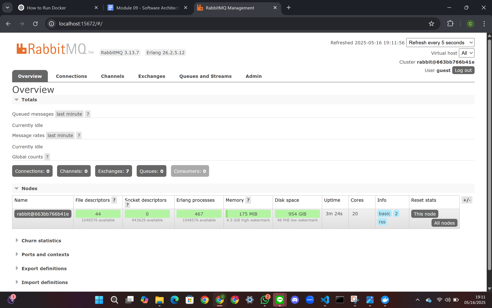
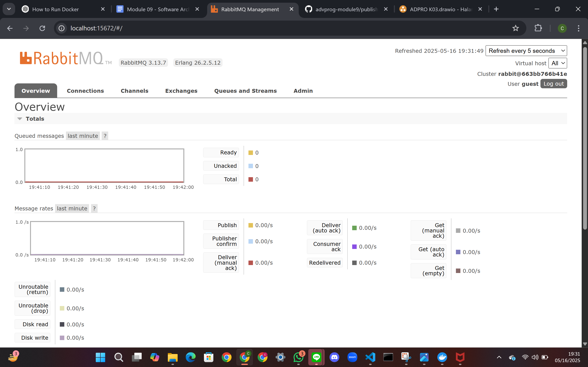
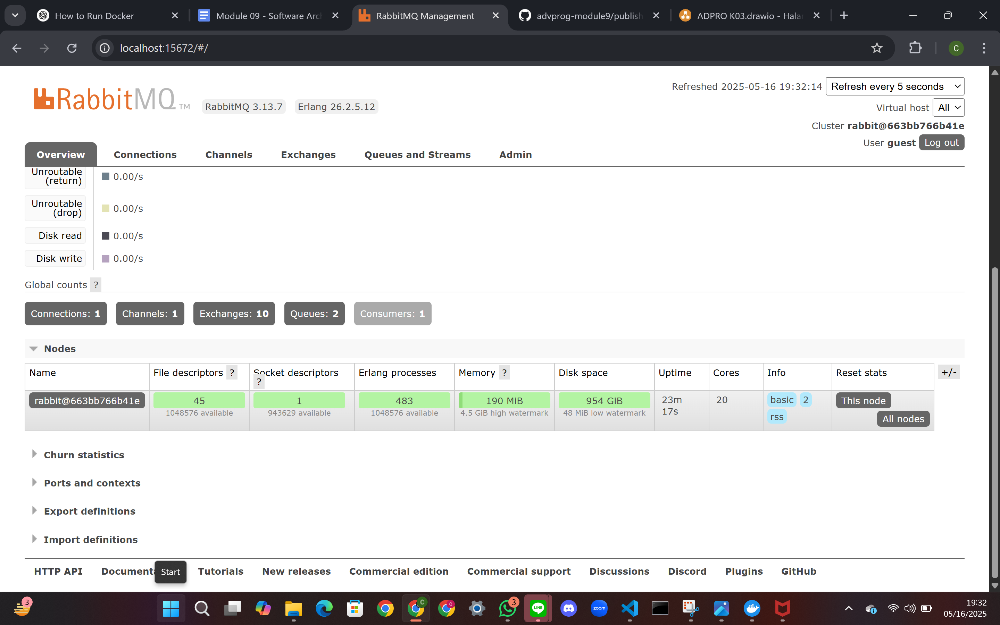
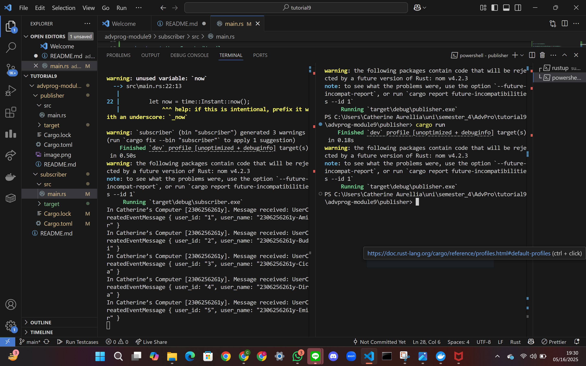
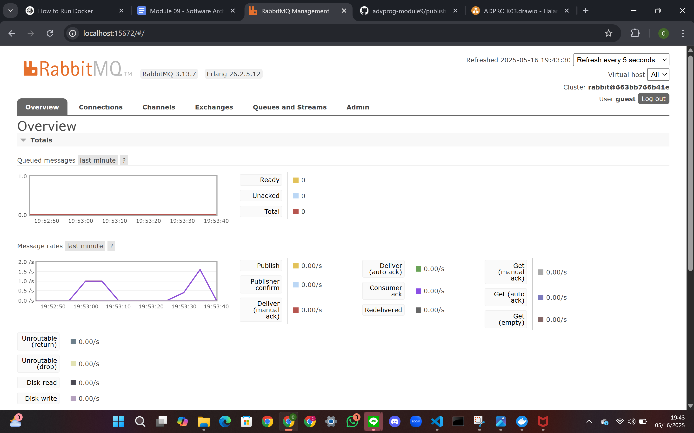

1. The **publisher** sends 5 `UserCreatedEventMessage` events to the message broker (RabbitMQ).
2. The **subscriber** listens to the `user_created` queue.
3. When the subscriber receives the events, it prints them to the console.

This spike indicates that a burst of messages was published by the publisher and delivered to the message broker. In this case, the publisher sent 5 events in quick succession, resulting in a noticeable peak in the chart.

RabbitMQ's chart displays the **rate of messages per second**, so when multiple events are sent in a short time, the message rate rises sharply, forming a visible triangle (spike). If the publisher is run multiple times with small delays in between, multiple spikes can be observed—each representing a new burst of events.