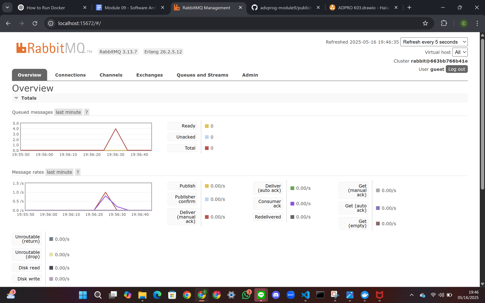
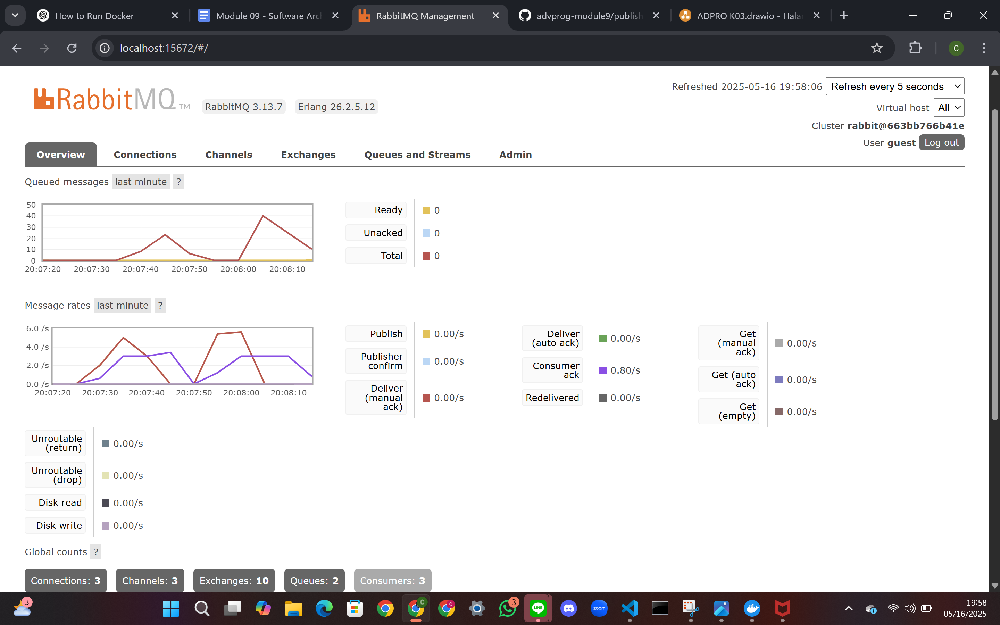

In my machine, the total number of queues is **2**.

The number of queues in RabbitMQ depends on:
- How many listeners you’ve run (each `.listen()` call creates a new queue).
- Whether `auto_delete` is set to `false`, meaning the queue remains even after the program stops.
- Whether previous test runs created queues without being deleted.

With more subscriber instances:

The message queue was processed faster.

The spike on the message rate chart decreased more sharply, because multiple consumers were handling the messages in parallel.

This demonstrates the scalability of message-driven architecture with RabbitMQ. Adding more subscribers helps reduce queue backlog and improves responsiveness.

Improvement: Add error handling in case message delivery or handling fails. Consider extracting configuration (AMQP URL, queue name) into environment variables for flexibility.